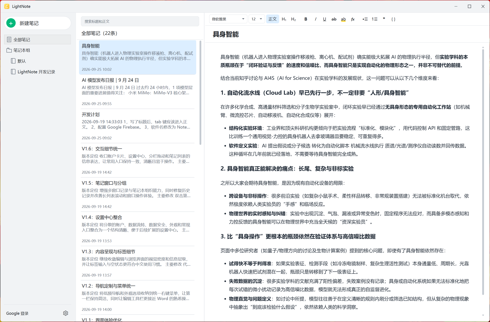

<p align="center">
  
</p>

<h1 align="center">LightNote</h1>

<p align="center"><strong>Windows 优先、本地优先的轻量笔记应用。</strong></p>

LightNote 是一个专为 Windows 打造的轻量、本地优先笔记工具，支持毫秒级 SQLite FTS5 全文搜索、多级分组、KaTeX 数学公式、多版本历史记录与可选的云端同步。当前版本为 **V1.8 数学公式与数据一致性版**。

<p align="center">
  
</p>

## 当前能力

- 新建、选择、重命名、编辑和置顶笔记。
- 新建与切换一级笔记本。
- 创建笔记本组并将笔记本移入、移出、重命名或删除分组；删除分组不会删除笔记本和笔记。
- SQLite FTS5 标题与正文全文搜索，250 毫秒防抖查询和结果关键词高亮。
- 中文、英文、数字和混合关键词搜索；短关键词自动使用兼容查询。
- 最近笔记、置顶笔记、全部笔记和回收站快捷视图。
- 多标签编辑、标签筛选，以及笔记本间移动。
- 每篇笔记自动保留最近 20 个内容版本，并可从历史记录恢复。
- 段落、两级标题、粗体、斜体、项目符号、编号列表、引用、代码块以及 KaTeX 行内与块级数学公式。
- 编辑器撤销/重做，以及选区格式与 WPF 工具栏状态同步。
- 从剪贴板直接粘贴截图，或拖入 PNG、JPEG、WebP 和 GIF（单张最大 20 MB）。
- 图片按 SHA-256 去重，保存尺寸与相对路径，重启后仍可离线显示。
- 正文删图后延迟 24 小时回收文件，期间撤销可恢复引用。
- 500 毫秒防抖自动保存和 `Ctrl+S` 立即保存。
- 软删除、回收站恢复和确认后永久删除。
- 关闭前强制保存；失败时阻止退出并保留内存草稿。
- 未保存内容写入独立恢复草稿，异常退出后会在下次启动自动恢复。
- 一键备份 SQLite 数据库和图片附件，并可安全恢复到指定空目录。
- 备份包含版本、大小与 SHA-256 清单，采用临时文件和原子替换；恢复前在暂存目录校验归档与 SQLite。
- 单篇笔记导出为自包含 HTML、纯文本或带本地图片目录的 Markdown。
- 启动时执行 SQLite 快速完整性检查，并记录缺失附件警告。
- Firebase 邮箱密码登录，ID token 自动刷新，refresh token 使用 Windows 用户级加密保存。
- SQLite outbox 增量上传笔记、笔记本、标签与图片，并在断网后指数退避重试。
- 持久删除墓碑和单调同步修订号确保长期离线、同步中再次编辑时仍不会丢失最后一次变更。
- Firestore 服务端更新时间游标避免设备时钟偏差造成漏同步；附件下载校验大小和 SHA-256 后原子落盘。
- Firestore 增量拉取和 Firebase Storage 图片上传/下载；未配置 Firebase 时完全不影响本地使用。
- 远端较新内容优先，尚未同步的本地内容自动保留为可恢复的冲突历史版本。
- 每分钟后台同步和顶部手动同步状态入口。
- 第一栏账户卡片集中管理 Google 登录、同步和颜色模式；设置中心分别提供导入与导出、备份和数据安全页面。
- 设置中心的数据安全页显示待同步数、冲突副本、最近备份和完整性结果，可完整验证最近备份并生成不含正文与令牌的脱敏诊断包。
- 历史窗口支持当前内容与任一历史版本或同步冲突副本并排预览后再决定是否恢复。
- 浅色、深色与跟随系统主题；深色主题同时覆盖原生界面和 WebView2 编辑器。
- 单实例运行；重复启动会唤醒现有窗口。
- 记忆窗口大小、位置、最大化状态以及笔记本/列表栏宽。
- 每日自动备份，默认保留最近 10 份，可在设置中调整或关闭。
- 缺少 WebView2 Runtime 时给出说明并可打开微软官方下载页。
- x64 自包含发布和按当前用户安装的安装包，不依赖目标电脑预装 .NET。
- Per-Monitor V2 高 DPI 清单以及 WPF 原生键盘焦点导航。
- 多选导入 ENEX、Google Keep JSON、CSV、Markdown、纯文本和 HTML 文件，单个坏文件不会中断整批导入。
- 递归导入文件夹，自动建立同名笔记本，并在标题中保留子目录路径。
- 印象笔记和有道云笔记可通过 ENEX 迁移，一份 ENEX 中的多篇笔记会分别创建。
- Google Keep 可从解压后的 Google Takeout `Keep` 文件夹迁移，并保留标题、清单、标签、置顶和时间。
- ENEX、Google Keep 和 CSV 标签会写入真实标签关系；ENEX 内嵌图片、Keep 图片以及 Markdown/HTML 相对图片会进入统一附件库并去重。
- 浮墨笔记 HTML 以及含多个 `article` 条目的网页导出会自动拆分；常见 CSV 中英文列名和跨行正文可自动识别。
- 为知笔记、WPS 便签/WPS 笔记、小米云笔记等可通过其能够导出的 HTML、Markdown、TXT 或 CSV 迁移；私有 `.ziw`、`.ynote` 格式暂不直接解析。
- Markdown 标题、段落、列表、引用、代码块、粗体、斜体和行内代码会转换为可继续编辑的富文本。
- HTML 导入会移除脚本、样式及嵌入对象；本地相对图片会被复制，远程或不受支持的图片会显示占位说明并在结果中提示。
- 最近修改排序，并按笔记 ID 隔离快速切换时的待保存内容。
- 双击列表中的笔记可在独立编辑窗口打开，并继续使用格式工具栏、附件与自动保存。
- 笔记列表和搜索支持分批加载与 UI 虚拟化，可连续浏览超过首屏限制的数据。
- WebView2 加载随应用发布的本地编辑器资源。
- WPF 与编辑器通过结构化 JSON 双向通信。
- `%UserProfile%\.lightnote` 下的数据、附件、日志和 WebView2 目录。
- 启动及未处理异常日志，以及界面内日志目录入口。

快捷键：`Ctrl+N` 新建笔记、`Ctrl+Shift+N` 新建笔记本、`Ctrl+S` 保存、`Ctrl+F` 聚焦全文搜索。

本地数据默认位于 `%UserProfile%\.lightnote`，避免从 MSIX 应用（例如 Codex）启动时受到 LocalAppData 重定向影响。首次启动时会从旧的 `%LocalAppData%\LightNote` 及应用包私有目录中选择笔记最多的数据安全迁移。应用内“备份”会把数据库和附件打包到该目录的 `backups` 子目录；“恢复”始终写入用户选择的空目录，避免覆盖正在使用的数据。

Firebase 参数暂未内置。收到项目配置后，将 [配置模板](docs/firebase.example.json) 复制为 `%UserProfile%\.lightnote\firebase.json`，并按 [Firebase 配置说明](docs/firebase-setup.md) 发布私有安全规则即可进行真实云端联调。

## 开发

要求：Windows 10/11、.NET 10 SDK、Microsoft Edge WebView2 Runtime。

修改 Tiptap 编辑器后先生成随应用发布的静态资源：

```powershell
Push-Location editor
npm ci
npm run build
Pop-Location
```

```powershell
dotnet restore LightNote.slnx
dotnet build LightNote.slnx
dotnet test LightNote.slnx
.\scripts\build-dev.ps1
.\scripts\run-dev.ps1
```

当前开发版的唯一入口为 `artifacts\development\current\win-x64\LightNote.exe`；不要直接运行历史发布目录中的程序。

生成 x64 自包含发布和 Inno Setup 安装包：

```powershell
.\scripts\build-installer.ps1
```

发布目录为 `artifacts\releases\1.10.0\win-x64`，安装包为 `artifacts\installers\LightNote-1.10.0-win-x64-setup.exe`。脚本会先重建编辑器并运行全部测试；安装、升级和卸载只操作程序目录，用户数据仍保存在 `%UserProfile%\.lightnote`。

构建产物规范见 [docs/build-artifacts.md](docs/build-artifacts.md)，详细路线见 [docs/implementation-plan.md](docs/implementation-plan.md)。
